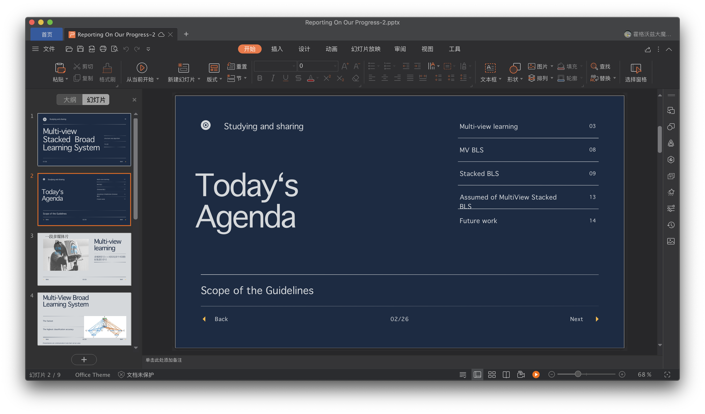
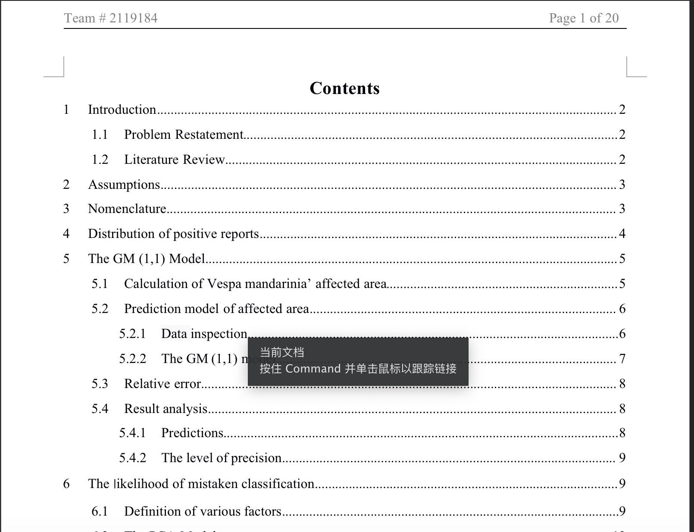

# My first blog with undpchina
- - - -
## Girl’s Coding Day🥳  
感谢联合国开发署的线上活动让我终于想起了自己Github的密码。

这里是一位数学系女孩！👩‍🦰目前南方一位没有冬天的城市就读大二，专业和自己学习研究的一些笔记以后都会发布在github上，项目里自己码的代码也会上传上来。敬请指正和交流。

## #让科技遇见她 #一小时编程挑战 的两个小故事
与其说分享克服性别偏见的故事，不如说是做自己的故事。女孩遇到的种种“反对”在生活中那么常见，但没有阻拦我们的，终究会让我们拥有自信说“no”的勇气。

> 在男女比例5:1的实验室做survey的presentation 

> 两个数学系女孩组队在寒假奋战第一次数模比赛  

